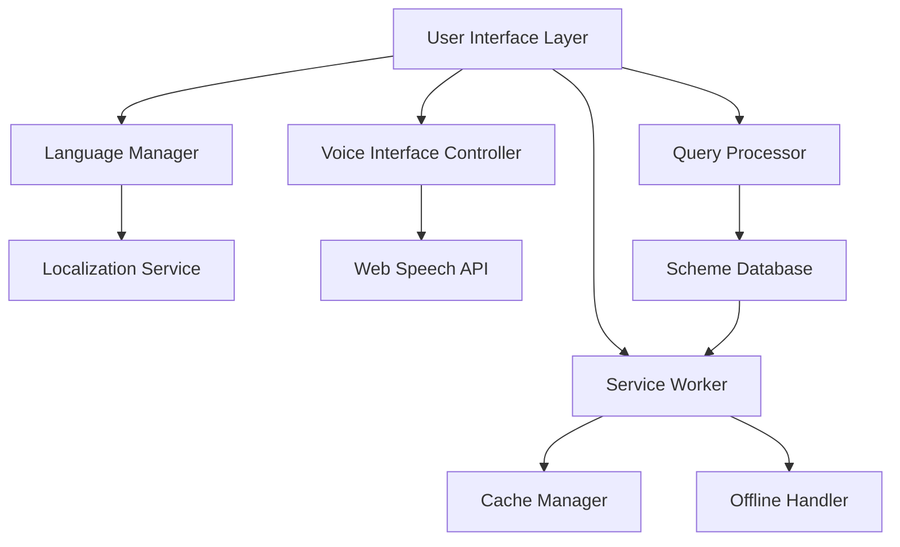

# Design Document: Community Resource Navigator

## Overview

The Community Resource Navigator is a client-side Progressive Web Application that provides multilingual access to government schemes for underserved communities in India. The system uses a voice-first interface with text alternatives, leveraging browser-native Web Speech APIs for speech recognition and synthesis.

The application follows a single-file architecture using vanilla JavaScript, HTML5, and TailwindCSS to ensure simplicity, fast loading, and minimal maintenance overhead. All processing occurs client-side to ensure privacy and reduce infrastructure costs.

Key design principles:
- **Voice-first interaction**: Primary interface through speech with text fallback
- **Multilingual support**: Native language support for English, Hindi, Marathi, and Tamil
- **Offline-capable**: PWA with service worker for offline functionality
- **Accessibility-first**: WCAG 2.1 AA compliance from the ground up
- **Performance-optimized**: <2s load time, <500ms voice response latency

## Architecture

### High-Level Architecture



### Component Architecture

The application is structured as a modular single-page application with the following core components:

1. **UI Controller**: Manages DOM interactions and state updates
2. **Language Manager**: Handles language switching and localization
3. **Voice Interface Controller**: Manages speech recognition and synthesis
4. **Query Processor**: Processes natural language queries and matches schemes
5. **Scheme Database**: In-memory database of government schemes
6. **PWA Manager**: Handles service worker, caching, and offline functionality

### Technology Stack

- **Frontend**: HTML5, TailwindCSS 3.x, Vanilla JavaScript (ES6+)
- **Speech APIs**: Web Speech API (SpeechRecognition, SpeechSynthesis)
- **PWA**: Service Worker API, Web App Manifest
- **Build Process**: None (direct deployment of static files)
- **Hosting**: Static hosting (GitHub Pages, Netlify, Vercel)

## Components and Interfaces

### Language Manager

**Purpose**: Manages language selection, switching, and localization across the application.

**Interface**:
```javascript
class LanguageManager {
  constructor(supportedLanguages, defaultLanguage)
  getCurrentLanguage(): string
  setLanguage(languageCode: string): void
  translate(key: string, params?: object): string
  getSpeechLanguageCode(): string
}
```

**Responsibilities**:
- Maintain current language state
- Provide translation services for UI elements
- Map language codes to Web Speech API language identifiers
- Persist language preferences in localStorage

### Voice Interface Controller

**Purpose**: Handles all speech recognition and text-to-speech functionality.

**Interface**:
```javascript
class VoiceInterfaceController {
  constructor(languageManager, onSpeechResult, onSpeechError)
  startListening(): void
  stopListening(): void
  speak(text: string, options?: SpeechOptions): void
  isListening(): boolean
  isSupported(): boolean
}
```

**Responsibilities**:
- Initialize and configure Web Speech API
- Handle speech recognition events and errors
- Manage text-to-speech playback
- Provide visual feedback for speech states

### Query Processor

**Purpose**: Processes natural language queries and matches them to relevant government schemes.

**Interface**:
```javascript
class QueryProcessor {
  constructor(schemeDatabase, languageManager)
  processQuery(query: string): Promise<QueryResult[]>
  getSchemesByCategory(category: string): Scheme[]
  searchSchemes(keywords: string[]): Scheme[]
}
```

**Responsibilities**:
- Parse natural language queries into searchable terms
- Match queries against scheme metadata
- Rank results by relevance
- Handle multilingual query processing

### Scheme Database

**Purpose**: Manages the collection of government schemes with multilingual metadata.

**Interface**:
```javascript
class SchemeDatabase {
  constructor(schemes: Scheme[])
  getAllSchemes(): Scheme[]
  getSchemesByCategory(category: string): Scheme[]
  searchByKeywords(keywords: string[], language: string): Scheme[]
  getSchemeById(id: string): Scheme
}
```

**Responsibilities**:
- Store and organize scheme data
- Provide efficient search and filtering
- Support multilingual scheme metadata
- Maintain scheme categorization

### PWA Manager

**Purpose**: Handles Progressive Web App functionality including offline support and installation.

**Interface**:
```javascript
class PWAManager {
  constructor()
  initialize(): void
  isOffline(): boolean
  canInstall(): boolean
  promptInstall(): void
  updateCache(): void
}
```

**Responsibilities**:
- Register and manage service worker
- Handle offline/online state changes
- Manage app installation prompts
- Cache management for offline functionality

## Data Models

### Scheme Model

```javascript
interface Scheme {
  id: string;
  category: SchemeCategory;
  names: LocalizedText;
  descriptions: LocalizedText;
  eligibility: LocalizedText;
  applicationProcess: LocalizedText;
  requiredDocuments: LocalizedText[];
  contactInfo: ContactInfo;
  targetDemographics: string[];
  geographicScope: string[];
  keywords: LocalizedKeywords;
  lastUpdated: Date;
}
```

### Localized Text Model

```javascript
interface LocalizedText {
  en: string;
  hi: string;
  mr: string;
  ta: string;
}
```

### Query Result Model

```javascript
interface QueryResult {
  scheme: Scheme;
  relevanceScore: number;
  matchedKeywords: string[];
  matchType: 'exact' | 'partial' | 'semantic';
}
```

### Speech Configuration Model

```javascript
interface SpeechConfig {
  language: string;
  continuous: boolean;
  interimResults: boolean;
  maxAlternatives: number;
}
```

### User Preferences Model

```javascript
interface UserPreferences {
  language: string;
  voiceEnabled: boolean;
  speechRate: number;
  speechVolume: number;
  highContrast: boolean;
  fontSize: 'small' | 'medium' | 'large';
}
```

### Application State Model

```javascript
interface AppState {
  currentLanguage: string;
  isListening: boolean;
  isOffline: boolean;
  currentQuery: string;
  searchResults: QueryResult[];
  selectedScheme: Scheme | null;
  userPreferences: UserPreferences;
}
```

## Correctness Properties

*A property is a characteristic or behavior that should hold true across all valid executions of a system—essentially, a formal statement about what the system should do. Properties serve as the bridge between human-readable specifications and machine-verifiable correctness guarantees.*

### Property 1: Language State Preservation
*For any* application state and any supported language selection, switching languages should preserve all current application context (query content, search results, selected schemes) while updating all UI text to the new language.
**Validates: Requirements 1.2, 1.4, 3.4**

### Property 2: Voice Interface Workflow
*For any* voice input activation, the system should provide visual feedback, process speech through Web Speech API, and display recognized text for user confirmation with appropriate error handling for recognition failures.
**Validates: Requirements 2.1, 2.2, 2.3, 2.4**

### Property 3: Input Method Equivalence  
*For any* query string, processing through voice input and text input should produce identical search results and system behavior.
**Validates: Requirements 3.2**

### Property 4: Multilingual Query Processing
*For any* natural language query in any supported language, the query processor should extract relevant keywords, match against appropriate scheme categories, and handle variations in phrasing and synonyms.
**Validates: Requirements 4.1, 4.2, 4.3, 4.5**

### Property 5: Scheme Database Completeness
*For any* scheme in the database, it should contain all required metadata fields (eligibility, application process, required documents, contact info) in all four supported languages.
**Validates: Requirements 5.2, 5.3**

### Property 6: Category Filtering Accuracy
*For any* category selection, the system should display only schemes belonging to that category and show accurate counts of available schemes.
**Validates: Requirements 8.2, 8.3**

### Property 7: Text-to-Speech Functionality
*For any* displayed content and any supported language, the TTS system should read content in the correct language with proper pronunciation and support playback controls (pause, resume, stop).
**Validates: Requirements 7.1, 7.2, 7.5**

### Property 8: Offline Functionality Preservation
*For any* cached content, when the system is offline, essential functionality should remain available and the system should clearly indicate offline status.
**Validates: Requirements 9.3, 9.4**

### Property 9: Accessibility Markup Completeness
*For any* interactive element, it should have appropriate ARIA labels, semantic markup, and keyboard navigation support.
**Validates: Requirements 10.2, 10.3**

### Property 10: Client-Side Privacy Preservation
*For any* user interaction, no personal data should be transmitted to external servers, and all processing should occur client-side using browser-native APIs.
**Validates: Requirements 12.1, 12.2, 12.4**

### Property 11: Search Result Ranking Consistency
*For any* query that matches multiple schemes, results should be ranked by relevance score and user demographic matching with consistent ordering for identical queries.
**Validates: Requirements 6.4**

### Property 12: Scheme Detail Completeness
*For any* scheme detail view, all required information fields (name, description, eligibility, process, documents) should be displayed with expand/collapse functionality.
**Validates: Requirements 6.2, 6.3**

## Error Handling

### Speech Recognition Errors
- **Network Unavailable**: Gracefully degrade to text input with clear messaging
- **Microphone Access Denied**: Provide clear instructions and fallback to text input
- **Speech Not Recognized**: Offer to try again or switch to text input
- **Language Not Supported**: Inform user and suggest supported alternatives

### Query Processing Errors
- **No Results Found**: Suggest alternative search terms or browse by category
- **Ambiguous Query**: Present clarifying questions to narrow search
- **Invalid Input**: Provide helpful error messages and input format guidance
- **Database Unavailable**: Show cached results if available, otherwise inform user

### Offline Handling
- **Network Connection Lost**: Switch to offline mode with cached content
- **Cache Miss**: Inform user of limited functionality and suggest reconnection
- **Service Worker Failure**: Fallback to online-only mode with appropriate messaging

### Accessibility Errors
- **Screen Reader Compatibility**: Ensure all content has appropriate ARIA labels
- **Keyboard Navigation Failure**: Provide alternative navigation methods
- **Color Contrast Issues**: Offer high contrast mode toggle
- **Font Size Problems**: Provide font size adjustment controls

## Testing Strategy

### Dual Testing Approach

The testing strategy employs both unit tests and property-based tests to ensure comprehensive coverage:

**Unit Tests**: Focus on specific examples, edge cases, and integration points
- Language switching with specific language combinations
- Voice recognition error scenarios
- Offline state transitions
- Accessibility compliance for specific UI components
- PWA installation and manifest validation

**Property-Based Tests**: Verify universal properties across all inputs
- Language state preservation across random application states
- Query processing consistency across generated test queries
- Scheme database completeness across all stored schemes
- TTS functionality across random content and languages
- Client-side privacy across all user interactions

### Property-Based Testing Configuration

**Testing Library**: Use `fast-check` for JavaScript property-based testing
**Test Configuration**: Minimum 100 iterations per property test
**Test Tagging**: Each property test tagged with format:
`Feature: community-resource-navigator, Property {number}: {property_text}`

**Example Property Test Structure**:
```javascript
// Feature: community-resource-navigator, Property 1: Language State Preservation
fc.assert(fc.property(
  fc.record({
    currentQuery: fc.string(),
    selectedScheme: fc.option(schemeGenerator),
    searchResults: fc.array(queryResultGenerator)
  }),
  fc.constantFrom('en', 'hi', 'mr', 'ta'),
  (appState, newLanguage) => {
    const originalState = cloneDeep(appState);
    languageManager.setLanguage(newLanguage);
    
    // Verify state preservation
    expect(getCurrentQuery()).toBe(originalState.currentQuery);
    expect(getSelectedScheme()).toEqual(originalState.selectedScheme);
    expect(getSearchResults()).toEqual(originalState.searchResults);
    
    // Verify language update
    expect(getCurrentLanguage()).toBe(newLanguage);
  }
), { numRuns: 100 });
```

### Integration Testing

**Component Integration**: Test interactions between major components
- Language Manager ↔ Voice Interface Controller
- Query Processor ↔ Scheme Database  
- PWA Manager ↔ Offline Functionality
- UI Controller ↔ All other components

**API Integration**: Test Web Speech API integration
- SpeechRecognition configuration and event handling
- SpeechSynthesis voice selection and playback
- Error handling for unsupported browsers

**PWA Integration**: Test Progressive Web App features
- Service Worker registration and caching
- App installation and manifest validation
- Offline functionality and cache management

### Performance Testing

**Load Time Validation**: Verify <2s initial load time
**Voice Latency Testing**: Ensure <500ms voice processing response
**Memory Usage Monitoring**: Track memory consumption during extended use
**Cache Efficiency Testing**: Validate offline performance and cache hit rates

### Accessibility Testing

**Automated Testing**: Use axe-core for automated accessibility validation
**Screen Reader Testing**: Manual testing with NVDA, JAWS, and VoiceOver
**Keyboard Navigation**: Comprehensive keyboard-only navigation testing
**Color Contrast Validation**: Automated contrast ratio verification